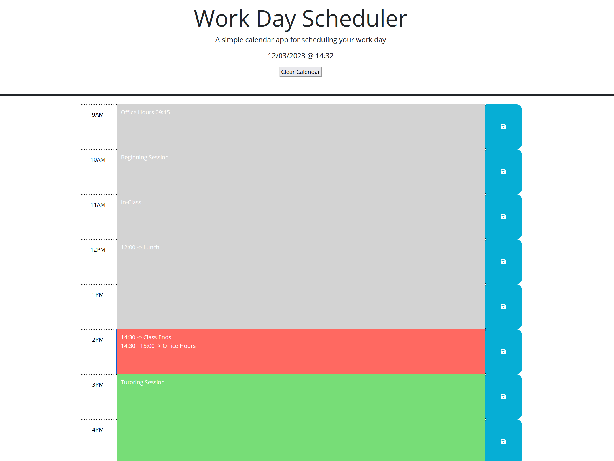

# Workday Scheduler [](https://opensource.org/licenses/MIT)

This is a minimalistic event scheduler. It stores events you've previously saved to local memory so that you can leave the page and not lose track of where you are. 

Technologies Used:
1. HTML
2. CSS
3. JavaScript
4. jQuery
5. dayJS
6. Google Fonts
7. GitHub
8. GitHub Pages

## User Story:
```md
AS AN employee with a busy schedule
I WANT to add important events to a daily planner
SO THAT I can manage my time effectively
```

## Usage
Please use this site to help you track events throughout your day. 


The site can be accessed here: https://hudsonpepper.github.io/workday-scheduler/

Example Screenshot of Deployed Site:



## Credits

Much of the code came from coursework in edX's Fullstack Web Development Bootcamp in collaboration with UPenn.

## License
MIT License

Copyright (c) 2023 hudsonpepper

Permission is hereby granted, free of charge, to any person obtaining a copy
of this software and associated documentation files (the "Software"), to deal
in the Software without restriction, including without limitation the rights
to use, copy, modify, merge, publish, distribute, sublicense, and/or sell
copies of the Software, and to permit persons to whom the Software is
furnished to do so, subject to the following conditions:

The above copyright notice and this permission notice shall be included in all
copies or substantial portions of the Software.

THE SOFTWARE IS PROVIDED "AS IS", WITHOUT WARRANTY OF ANY KIND, EXPRESS OR
IMPLIED, INCLUDING BUT NOT LIMITED TO THE WARRANTIES OF MERCHANTABILITY,
FITNESS FOR A PARTICULAR PURPOSE AND NONINFRINGEMENT. IN NO EVENT SHALL THE
AUTHORS OR COPYRIGHT HOLDERS BE LIABLE FOR ANY CLAIM, DAMAGES OR OTHER
LIABILITY, WHETHER IN AN ACTION OF CONTRACT, TORT OR OTHERWISE, ARISING FROM,
OUT OF OR IN CONNECTION WITH THE SOFTWARE OR THE USE OR OTHER DEALINGS IN THE
SOFTWARE.